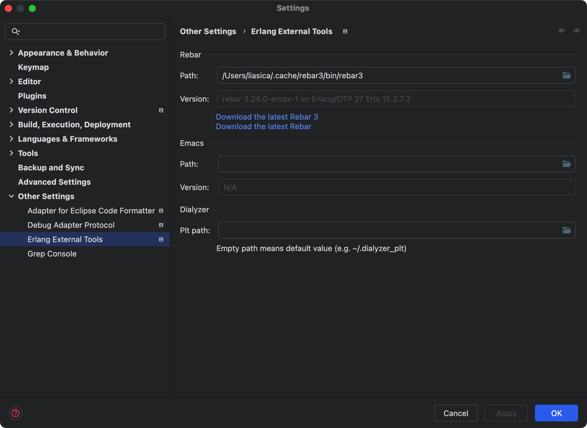
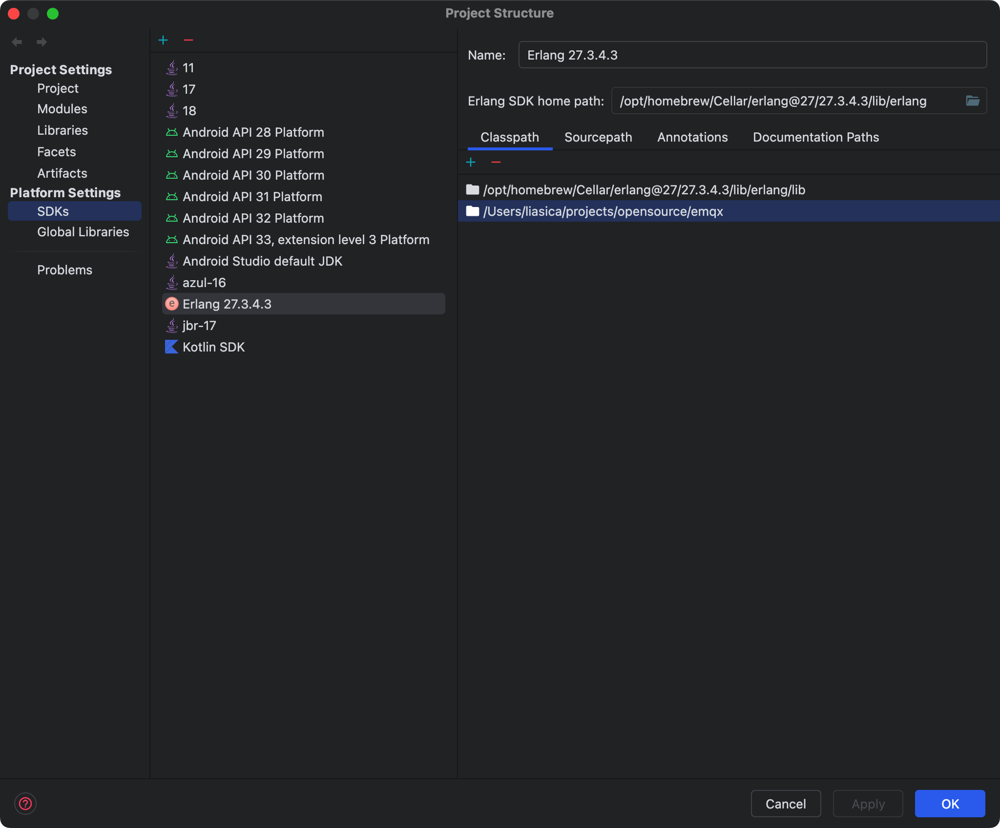

# client_info_emqx_plugin

> 客户端连接信息插件

一个附加客户端信息的EMQX插件，包含客户端IP地址、连接时间、协议类型等信息，附加前缀字节为 `0x12, 0x, 0x83, 0x08`
目前已附加：
- clientid
- peerhost

## 附加数据结构
| 0x01 0x35 0x83 0x08 | 0xNN 0xNN 0xNN 0xNN |  peerhost   |  clientid  | original payload |
|      Magic (4B)     |  len = N+M (4B, BE) |   4 or 16B  |    M bytes |                  |

例如 IPv4 192.168.1.100（4字节）+ ClientId "dev-01"（6字节）：

```bash
01 35 83 08  00 00 00 0A  C0 A8 01 64  64 65 76 2D 30 31  <原始payload>
             ↑ len = 10 (4+6)
```

## IDE配置



## 文档

- [插件扩展](https://docs.emqx.com/zh/emqx/latest/extensions/plugins.html)
- [.tool-versions](https://github.com/emqx/emqx/blob/e6.0.1/.tool-versions)

```shell
# 更新依赖
./rebar3 local install
./rebar3 local upgrade
./rebar3 upgrade --all

# 构建
make rel
```

## Release

1. A JSON format metadata file describing the plugin
2. Versioned directories for all applications needed for this plugin (source and binaries).
3. Confirm the OTP version used by EMQX that the plugin will be installed on (See also [./.tool-versions](./.tool-versions)).

In a shell from this plugin's working directory execute `make rel` to have the package created like:

```
_build/default/emqx_plugrel/client_info_emqx_plugin-<vsn>.tar.gz
```
## Format

Format all the files in your project by running:
```
make fmt
```

See [EMQX documentation](https://docs.emqx.com/en/enterprise/v5.0/extensions/plugins.html) for details on how to deploy custom plugins.
